# 基于Echarts的大学生创新能力培养系统

#### 介绍
基于数据可视化的大学生创新能力培养平台，采用协同过滤算法-java-Echarts-Vue-Mysql实现

## 01开发环境

1.1  Java技术

1.2  Springboot框架

1.3  MySQL数据库

1.4  B/S 结构

1.5  Vue.js 技术

1.6  协同过滤算法

1.7  ECharts可视化图表

##02系统功能模块

亮点（协同过滤算法推荐、Echarts可视化图表）

  具体运用基于用户的协同过滤方法，借助解析用户收藏行为数据，辨别出和目标用户有着相似兴趣偏好的用户群体，再依照这些相似用户的浏览历史记录为目标用户生成个性化的推荐列表。              

    协同过滤算法的核心机制是依靠量化用户之间的相似性程度达成个性化推荐，在这个过程中，余弦相似度作为经典的相似性度量办法，在该领域得到了广泛运用。

## 功能展示

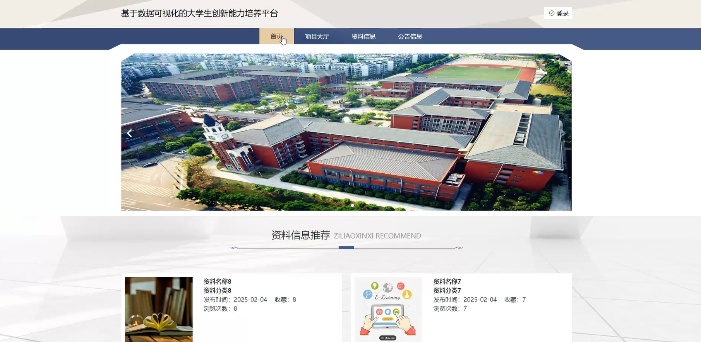
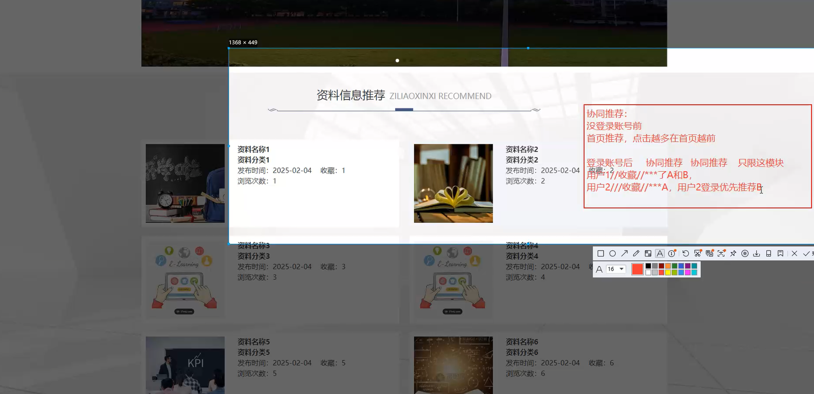
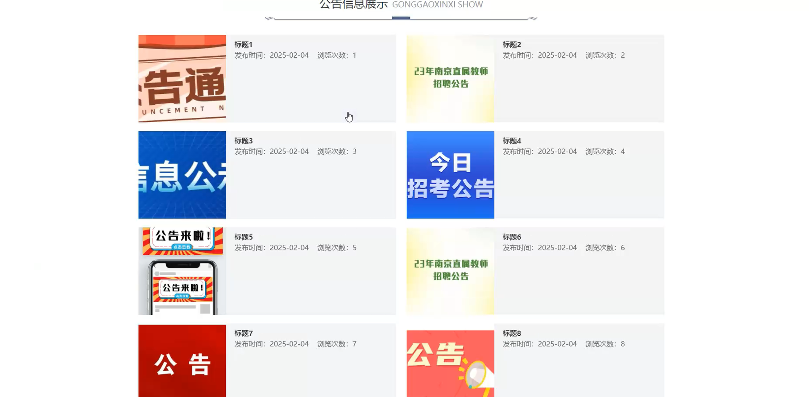
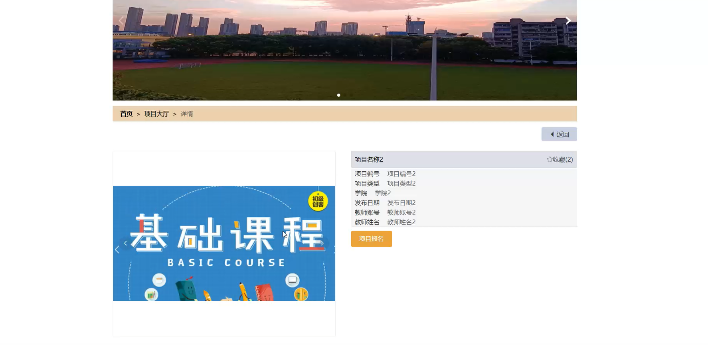
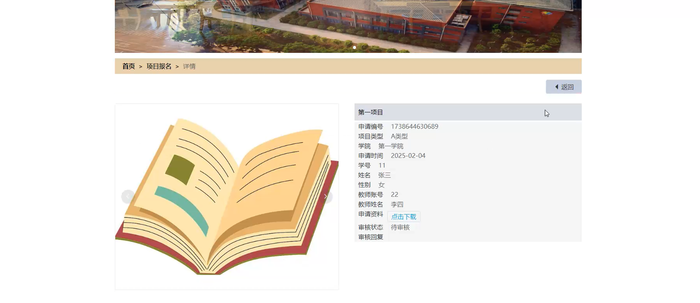
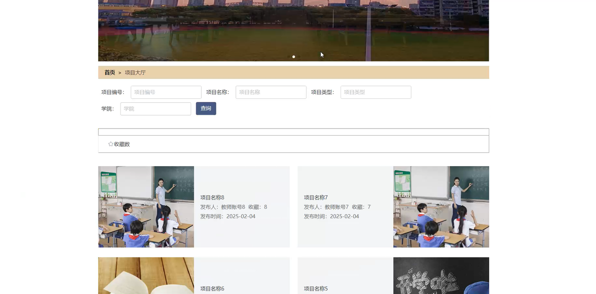
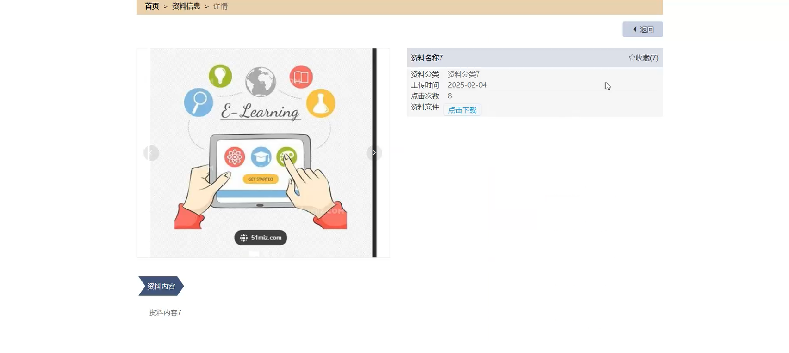

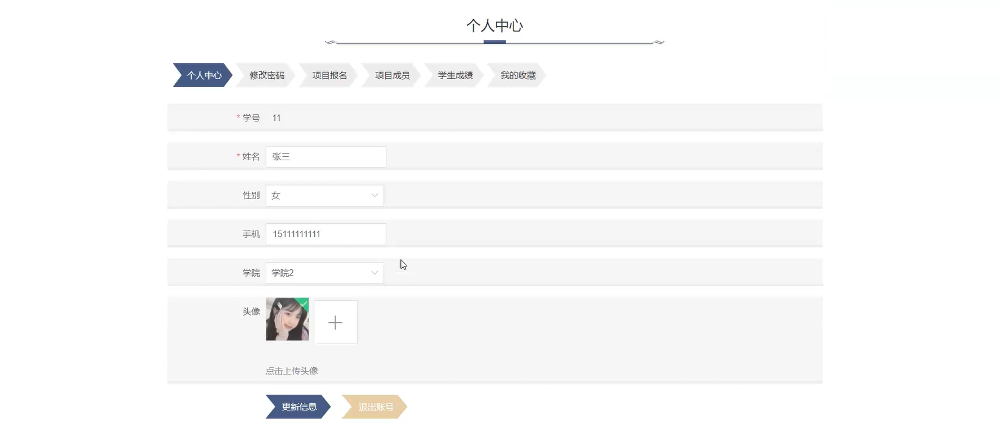
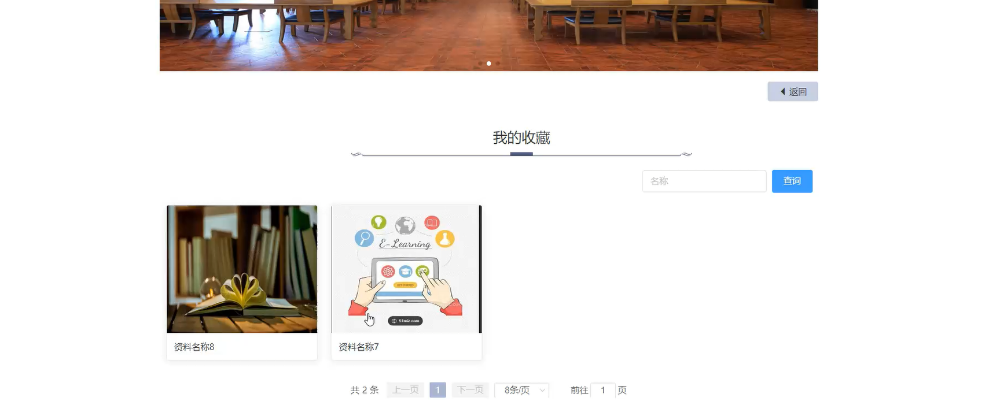

## 后台管理系统

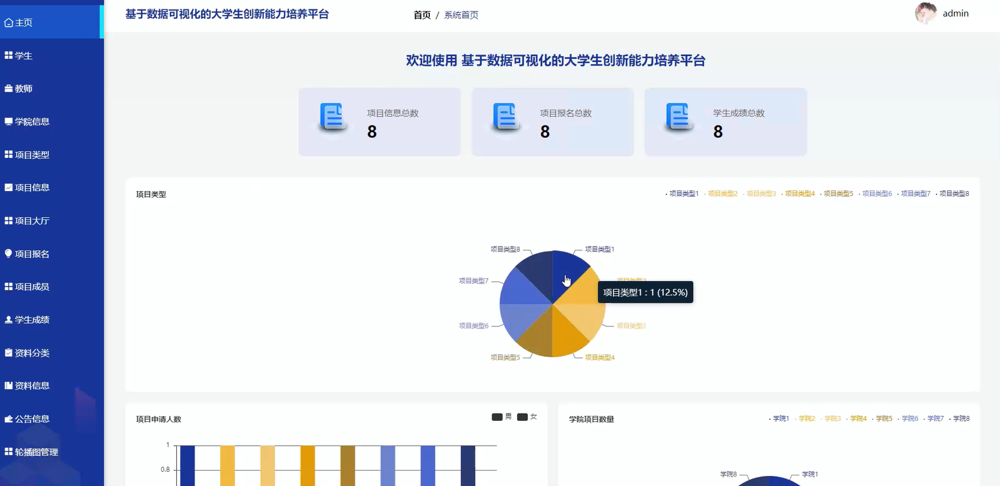
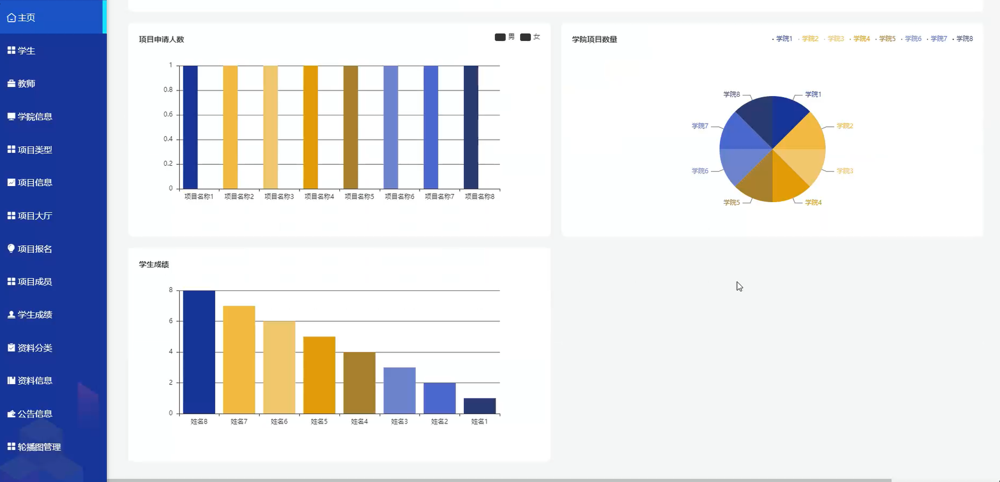
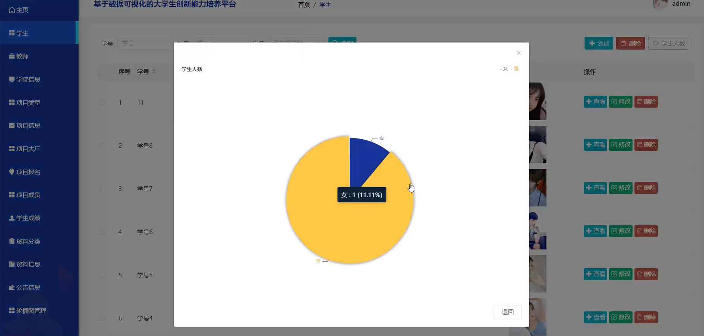
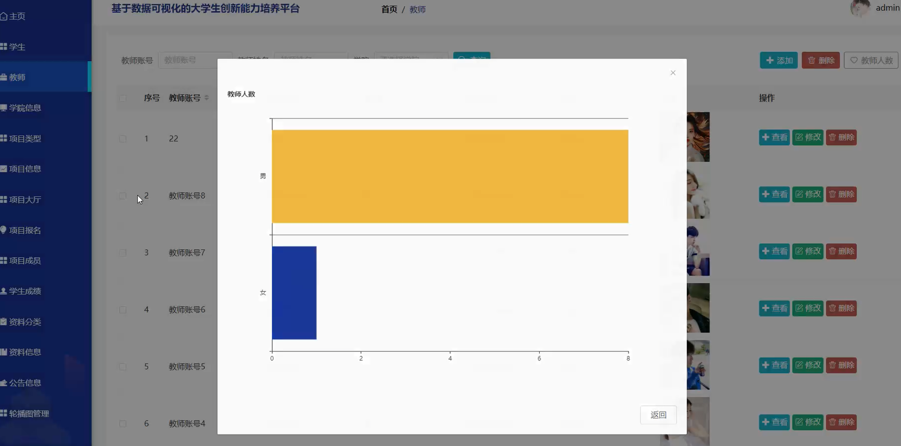
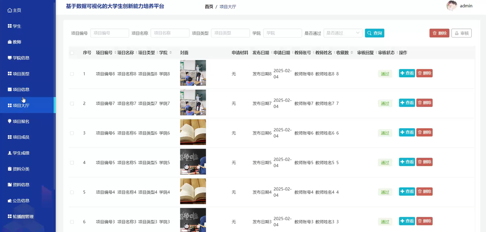
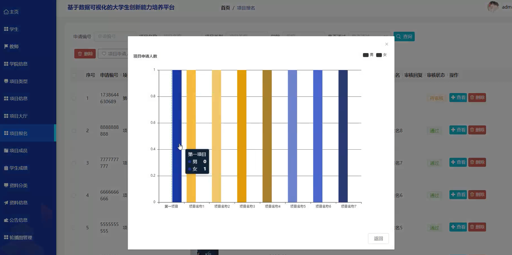
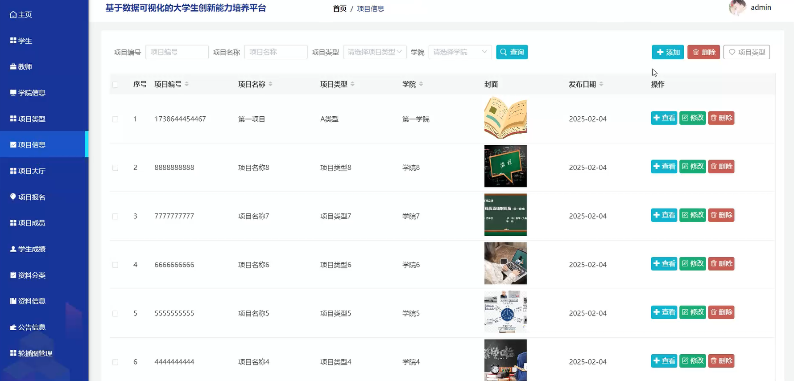
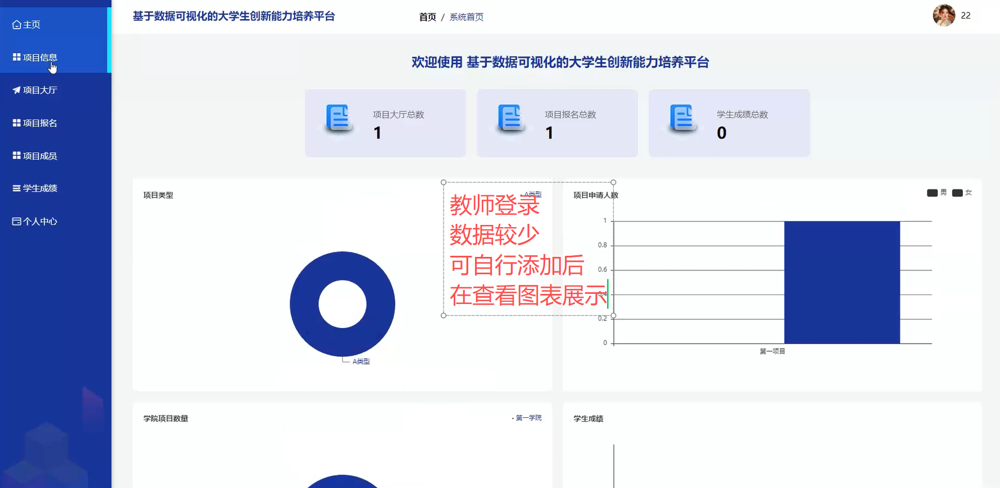

## 源码获取：+VX：18484646674   +QQ：2474345497
